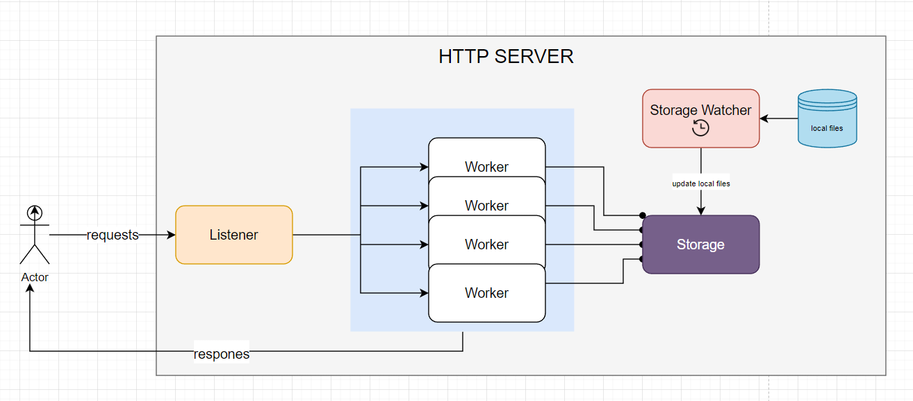
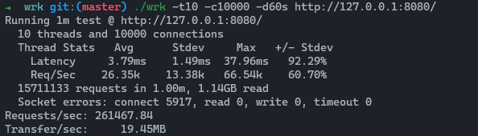
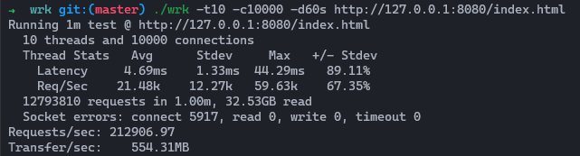
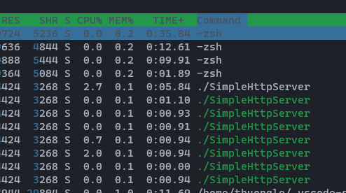
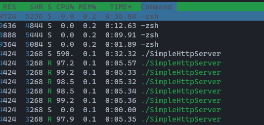

```
Forked and ref from: https://github.com/trungams/http-server
```
**How to use**

I already built the project to the folder `out`
```
➜  out git:(master) ✗ tree.
├── SimpleHttpServer
├── cpu_idle.png
├── cpu_loading.png
├── index.html
├── local_file.png
├── local_ram.png
└── overview.png
```
Just simply run the server:
```
cd out
./SimpleHttpServer
```

The server will be running on port `8080` 
**The document (system design and Benchmark) will be on:** `localhost:8080/index.html`
Or you can just open `out/index.html`

**How to build**
```
cd simplehttpserver
mkdir build && cd build
cmake ../
make
# Please remember to copy index.html and other image files into this folder in order to serve the files
./SimpleHttpServer 

```

Features and Limitations
------------------------

*   Can handle at least 10k connections at the same time
*   Can serve more than 100k request per sec
*   Does no support for Multipart data
*   Support OS: Linux
*   Does not use any 3rd lib, just C++ standard and Linux sysem API

Architecture Overview
---------------------

*   1 main thread for starting the server and for user interact
*   1 Listener thread to accept incoming from clients and then propagate the request to the workers
*   N worker threads (by default, it is 5): those threads take the requests from the Listener and process HTTP requests, and then send the responses back to the client.
*   A component called Storage, this component will read files from the local dir, cache them, and serve it to workers when needed
*   We also have a thread called Storage\_Watcher for schedule update files content on time for Storage - every 5s
*   The purpose of Storage and Storage\_Watcher is to reduce the CPU process when dealing with local files. We will provide the content as quick as possible and we also the content is updated
*   Some utility functions parse HTTP requests and responses


Benchmark
---------

I using this tool for checking the perf: https://github.com/wg/wrk

> *   OS: Ubuntu 20.04 LTS
> *   CPU: Intel(R) Core(TM) i7-8700 CPU @ 3.20GHz
> *   Memory: 8GB

> **Testing with the resource in RAM (local variable)**
> 
> *   URL: http://127.0.0.1:8080/
> *   Time: 60s
> 
> 

> **Testing with the resource in local files (which are cached in Storage)**
> 
> *   URL: http://127.0.0.1:8080/index.html
> *   Time: 60s
> 
> 

> **CPU when IDLE**
> 
> 

> **CPU when Loading**
> 
> 

Future feature and Enhancement
------------------------------

*   Add service watcher: we need a watcher server in order to recover and make the server run almost 99.99% of the time
*   Dynamic configuration with config files
*   Storage\_Watcher right now will automatically update the content of the files every 5s, this wait will slow down the system if there are too many files to cache.  
    We need a new way that is more efficient, eg: inotify or some 3rd lib
*   Use a service for replacing Storage. Storage right now needs a mutex to work in multithread, we can improve it by using some 3rd party SW, like Redis for caching file contents
*   Add Logger: Logger is a critical feature for a SW, especially for a web server.
*   Support Multipart data
*   Bandwidth throttling or API rate limit
 